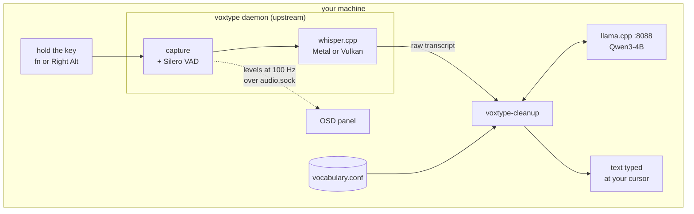

# voxtype-local-dictation

[](LICENSE)
[](docs/install-macos.md)
[](docs/install-linux.md)

Hold a key, speak, release. [whisper](https://github.com/ggml-org/whisper.cpp)
transcribes on your own machine, a local
[Qwen3-4B](https://huggingface.co/unsloth/Qwen3-4B-Instruct-2507-GGUF) on
[llama.cpp](https://github.com/ggml-org/llama.cpp) rewrites the transcript into
clean prose, and the text is typed at your cursor. Dictation never leaves the
machine on the default path, and there is no network round trip between
speaking and the text landing.

Built around [peteonrails/voxtype](https://github.com/peteonrails/voxtype),
which does the daemon, the hotkey, the whisper pipeline and the meeting engine.
This repository is the deployment around it, plus the two pieces macOS was
missing.


## What you see while dictating

The panel above appears when you press the key, and follows the microphone at
100 Hz until you let go. Then whisper and the cleanup model take over, and it
dims and says so rather than vanishing into a silent gap:


Both pictures come out of the renderer itself
(`voxtype-osd-macos --render`, drawing a seeded waveform), so they stay in step
with the code and contain nothing anyone actually said.

## Features

### Dictation you can use for prose

Raw whisper output is a wall of lowercase with the filler words left in. The
cleanup filter hands it to a Qwen3-4B held resident by llama.cpp and gets back
punctuated, capitalized text with your technical vocabulary spelled the way you
spell it. Measured through the real filter, warm: about 145 ms at the median on
a desktop 4090, about 950 ms on an M1 Pro laptop. The same job through
`claude -p` measured a 7.9 s median, which is why the local path exists.

### It never loses your words

Every failure path in the filter prints your original transcript unchanged:
backend down, timed out, non-zero exit, empty answer, or an answer that grew,
shrank, dropped content words, or added words you never said. Four structural
guards check the model's reply before it is allowed to replace anything you
said, so the worst thing a confused model can do to you is leave the text
reading like raw whisper. The fourth is the mechanical form of "never add":
the answer may not contain more words than it was given, which is what stops a
model repairing your grammar with words of its own.

### An on-screen display for macOS

Upstream ships six OSD frontends and all six are Linux. This repository has a
single-file Swift one that attaches to the audio socket the daemon binds
anyway, ports the drawing math from upstream's Rust so the panel matches, and
adds the dimmed `transcribing` state the Linux panel cannot show. It runs as
its own LaunchAgent, so it needs no microphone permission of its own.

### Meeting mode with both halves of the call

The meeting engine captures remote participants by shelling out to `pactl` and
`parec`, which exist on Linux and not on macOS. This repository ships a Swift
binary that answers to both names and serves audio from a CoreAudio process
tap, so upstream's engine runs unmodified and the transcript contains the other
people in the call. `voxtype-meeting start` refuses before recording if the
shim is missing, then watches the daemon log for three seconds after starting,
because a meeting that silently records only your own half is worse than one
that refuses to start.

Both platforms run that preflight against whatever supplies the remote side —
the shim on macOS, a PipeWire `.monitor` source on Linux — and on both,
`stop` waits for the daemon to finalise the record before reporting the
meeting saved, since `voxtype meeting stop` returns while the last chunk is
still being transcribed and a summary chained onto a stop would otherwise
export an empty transcript.

### Meeting summaries

`voxtype-meeting summarize` writes the transcript to `~/Documents/Meetings/`,
then appends key points, action items and decisions. The backend is an ordered
chain, `codex,claude,local` by default, tried left to right until one returns
valid JSON, and the heading records which one answered. A transcript
is a much heavier job than a dictation, which is why this defaults to a hosted
model where the filter defaults to the local one; the `local` link
map-reduces the transcript through llama-server in ~1,400-word chunks instead,
and summarized a 34-second test meeting in 4 s.

`local` is only ever accepted as the **last** link, so a cloud failure falls
back to the machine and a local failure never escalates to the network. When
every link fails the command says why and prints the export path, because the
transcript was already saved. `VOXTYPE_MEETING_SUMMARY_BACKEND=local` keeps a
meeting entirely offline.

### One vocabulary file, two consumers

`vocabulary.conf` is the only place a technical term gets typed. Terms whisper
turns into different words go under `[misheard]` and become its
`initial_prompt`; terms it hears correctly and writes wrong go under
`[misspelled]`. Both lists reach the cleanup model's prompt. The split matters,
because an initial prompt is capped and, on near-silent audio, whisper's
failure mode is to echo it back as though you had said it. That list stays
short on purpose and the installer warns past 40 terms.

### Hosted models, and the one place they lead

The **dictation filter** also speaks to `claude -p`, `codex exec` and any
OpenAI-compatible endpoint. You pick one with an environment variable and it
stays picked; nothing reaches for a hosted model on its own, because falling
back from a 5 s local timeout to a 20 s cloud call would re-import the latency
the local path exists to remove.

**Meeting summaries are the deliberate exception.** One transcript, once,
where quality matters more than a round trip, so they default to a hosted chain
with the local model as the catch. What is constrained is the direction rather
than the choice: a chain may fall back toward the machine and never away from
it, so no transcript reaches the network because a local server happened to be
down. Set `VOXTYPE_MEETING_SUMMARY_BACKEND=local` and a meeting stays offline
like everything else.

### Installers you can read before you run them

Both installers take `--dry-run` and print every command they would otherwise
run. Re-running one is safe, since each step checks the current state before
touching it. Multi-gigabyte model downloads are reported and never performed,
the manual steps neither installer can do for you are printed at the end, and
`--uninstall` reverses the rest.

## How it works



That is the dictation path, and the only arrow on it that can reach the network
is the one you opt into with `VOXTYPE_CLEANUP_BACKEND`. Meeting summaries are a
separate path with a different default, described above.

## The two platforms

One repository, two implementations of the same stack:

| | macOS | Linux (Hyprland/Omarchy) |
|---|---|---|
| Push-to-talk key | `fn` (Globe) | Right Alt |
| Transcription | whisper on Metal | whisper on Vulkan/CUDA |
| Cleanup model | llama.cpp LaunchAgent, port 8088 | llama.cpp systemd user unit, port 8088 |
| Recording feedback | standalone OSD renderer (Swift) | the OSD voxtype spawns itself |
| Meeting mode | CoreAudio process tap impersonating `pactl`/`parec` | PipeWire monitor source |
| Trigger extras | Raycast script commands | Hyprland bind + Omarchy menu row |

Both halves assert the same voxtype configuration and read the same vocabulary
file, so a term you add for one machine works on the other after the next
install run.

## What is in here

- `macos/` holds the macOS installer and payload: the signed app-bundle setup,
  the payload scripts, the OSD and meeting-shim Swift sources, LaunchAgent
  plists, and a latency benchmark harness.
- `linux/` holds the Linux installer and payload: the same filter and meeting
  wrapper, a notifier shim, the templated `llama-server.service.in`, and
  optional compositor integration snippets.
- `vocabulary.conf` and `voxtype-vocab` are the shared vocabulary and its
  parser, read by both whisper's `initial_prompt` and the cleanup prompt.
- `docs/` covers install, configuration and troubleshooting for both platforms.

## Requirements

macOS 14.2 or later on Apple Silicon (the meeting shim needs the 14.2
process-tap API), the Xcode Command Line Tools for the two Swift sources, and
Homebrew for `llama.cpp`, `jq`, `terminal-notifier` and `coreutils`.

On Linux: `voxtype` itself, from
[AUR `voxtype-bin`](https://aur.archlinux.org/packages/voxtype-bin) or built
from source; `llama.cpp` with a CPU backend compiled in, since a GPU backend
alone is not enough (see
[install-linux](docs/install-linux.md#the-llamacpp-trap)); `jq`; `curl`; and
membership of the `input` group for the evdev hotkey.

Either way, 4 to 6 GB of disk for the models. The installers report those
downloads and never perform them.

## Quick start

```sh
git clone https://github.com/vantuan5644/voxtype-local-dictation
cd voxtype-local-dictation

./macos/install.sh --dry-run     # macOS: review, then run for real
./linux/install.sh --dry-run     # Linux: review, then run for real
```

What each phase does, and why the macOS daemon runs from Login Items instead of
a LaunchAgent, is in the install docs:

- [Installing on macOS](docs/install-macos.md)
- [Installing on Linux](docs/install-linux.md)
- [Configuration: keys, backends, environment variables](docs/configuration.md)
- [Troubleshooting](docs/troubleshooting.md)

## Attribution

This repository is a deployment, a port, and two original components on top of
[peteonrails/voxtype](https://github.com/peteonrails/voxtype) (MIT). The
daemon, hotkey, whisper pipeline and meeting engine are upstream's work, used
as a released binary. The macOS OSD renderer ports drawing math from
upstream's Rust OSD. [NOTICE.md](NOTICE.md) has the details; the license is
MIT.
