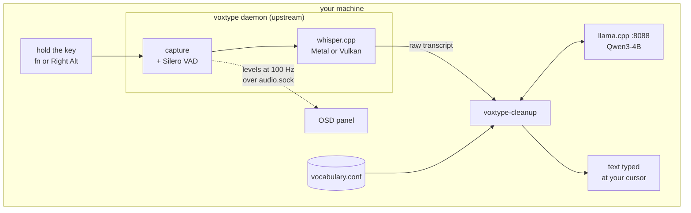

# voxtype-local-dictation

[](LICENSE)
[](docs/install-macos.md)
[](docs/install-linux.md)
[](docs/install-windows.md)

Hold a key, speak, release. [whisper](https://github.com/ggml-org/whisper.cpp)
transcribes on your own machine, a local
[Qwen3-4B](https://huggingface.co/unsloth/Qwen3-4B-Instruct-2507-GGUF) on
[llama.cpp](https://github.com/ggml-org/llama.cpp) rewrites the transcript into
clean prose, and the text is typed at your cursor. On the default path nothing
leaves the machine, and there is no network round trip between speaking and the
text landing.


The panel follows the microphone at 100 Hz while you hold the key, then dims to
`transcribing` rather than vanishing into a silent gap. The picture is drawn by
the renderer itself (`voxtype-osd-macos --render`), so it stays in step with
the code and contains nothing anyone said.

Built around [peteonrails/voxtype](https://github.com/peteonrails/voxtype),
which does the daemon, hotkey, whisper pipeline and meeting engine. This
repository is the deployment around it, plus the two pieces macOS was missing.
The Windows directory adds guarded cleanup, vocabulary tooling, a guided setup
application, and signed installer assembly around a Windows-enabled upstream build.

## What it adds

### Dictation you can use for prose

Raw whisper output arrives lowercase with the filler words left in. The cleanup
filter hands it to a resident Qwen3-4B and gets back punctuated, capitalized
text with your technical vocabulary spelled the way you spell it. Warm, through
the real filter: ~145 ms median on a desktop 4090, ~950 ms on an M1 Pro. The
same job through `claude -p` measured 7.9 s, which is why the local path
exists.

### It never loses your words

Every failure path prints your original transcript unchanged: backend down,
timeout, non-zero exit, empty answer, or an answer that grew, shrank, dropped
content words or added words you never said. The strictest of the four guards
is the mechanical form of "never add": the reply may not contain more words
than it was given.

### An on-screen display for macOS

Upstream ships six OSD frontends and all six are Linux. This one is a single
Swift file that attaches to the audio socket the daemon already binds, ports
upstream's drawing math so the panel matches, and adds the dimmed
`transcribing` state. It runs as its own LaunchAgent, so it needs no microphone
permission.

### Meeting mode with both halves of the call

Upstream captures remote participants by shelling out to `pactl` and `parec`,
which macOS does not have. A Swift binary here answers to both names and serves
audio from a CoreAudio process tap, so upstream's engine runs unmodified.
`voxtype-meeting start` refuses before recording if the shim is missing,
because a meeting that silently records only your half is worse than one that
will not start.

### Summaries that fall back toward your machine

`voxtype-meeting summarize` exports to `~/Documents/Meetings/`, then appends
key points, action items and decisions through an ordered backend chain
(`codex,claude,local` by default), recording which link answered. `local` is
only ever accepted last, so a cloud failure falls back to the machine and a
local failure never escalates to the network.
`VOXTYPE_MEETING_SUMMARY_BACKEND=local` keeps a meeting entirely offline.

### One vocabulary file

`vocabulary.conf` is the only place a technical term gets typed. Words whisper
turns into *different* words go under `[misheard]` and become its
`initial_prompt`; words it hears right and spells wrong go under
`[misspelled]`. Both reach the cleanup prompt. `[misheard]` stays short on
purpose: an initial prompt is capped, and on near-silent audio whisper echoes
it back as though you had said it. A guard warns past 40 terms. `voxtype-vocab
add btrfs` adds the term and re-applies it; `voxtype-vocab edit` opens
`$EDITOR` and applies only if something changed.

### Installers you can read before running them

The macOS and Linux installers take `--dry-run` and print every command they
would run. Re-running is safe, multi-gigabyte model downloads are reported and
left to the user, and `--uninstall` reverses the rest. Windows users receive a
signed bootstrap installer and choose online or offline models in a graphical
wizard. Maintainers can preview payload preparation before passing `-Apply`.

## How it works



During setup, Windows can download version-locked binaries and models after the
user selects the online option. The running dictation path stays local unless
you opt into a hosted `VOXTYPE_CLEANUP_BACKEND`. A failed local cleanup returns
the raw transcript instead of sending it elsewhere. Meeting summaries are the
deliberate exception, and even they prefer the machine.

## Platforms

| | macOS | Linux (Hyprland/Omarchy) | Windows 11 |
|---|---|---|---|
| Push-to-talk key | `fn` (Globe) | Right Alt | chosen during setup |
| Transcription | whisper on Metal | whisper on Vulkan/CUDA | upstream Windows build on Vulkan |
| Cleanup model | llama.cpp LaunchAgent, port 8088 | llama.cpp systemd user unit, port 8088 | packaged llama.cpp startup app, port 8088 |
| Recording feedback | standalone OSD renderer (Swift) | the OSD voxtype spawns itself | native notifications in v1 |
| Meeting mode | CoreAudio process tap | PipeWire monitor source | deferred |
| Trigger extras | Raycast script commands | Hyprland bind + Omarchy menu row | MSIX execution aliases |

All platforms assert the same core voxtype configuration and use the same
vocabulary format.

`macos/`, `linux/`, and `windows/` hold their platform payloads;
`vocabulary.conf` and `voxtype-vocab` are the shared vocabulary, its parser and
its maintenance command; `docs/` covers install, configuration and
troubleshooting.

## Requirements

macOS 14.2 or later on Apple Silicon (the meeting shim needs the 14.2
process-tap API), the Xcode Command Line Tools for the two Swift sources, and
Homebrew for `llama.cpp`, `jq`, `terminal-notifier` and `coreutils`.

On Linux: `voxtype` itself, from
[AUR `voxtype-bin`](https://aur.archlinux.org/packages/voxtype-bin) or source;
`llama.cpp` **with a CPU backend compiled in**, since a GPU backend alone is
not enough (see [install-linux](docs/install-linux.md#the-llamacpp-trap));
`jq`; `curl`; and membership of the `input` group for the evdev hotkey.

On Windows: Windows 11 x64 build 22621 or newer and about 4 GB of free storage.
The signed installer carries the application binaries and the guided setup
downloads or imports the models. The Windows v1 covers dictation and local
cleanup; meeting capture and OSD remain follow-up work.

Every platform needs 4 to 6 GB of disk for the models. The Windows wizard can
download them after explicit confirmation or import them from the offline bundle.

## Quick start

```sh
git clone https://github.com/vantuan5644/voxtype-local-dictation
cd voxtype-local-dictation

./macos/install.sh --dry-run     # macOS: review, then run for real
./linux/install.sh --dry-run     # Linux: review, then run for real
# Windows: download VoxTypeSetup from GitHub Releases and double-click it
```

- [Installing on macOS](docs/install-macos.md) — including why the daemon runs
  from Login Items instead of a LaunchAgent
- [Installing on Linux](docs/install-linux.md)
- [Installing on Windows](docs/install-windows.md)
- [Configuration: keys, backends, environment variables](docs/configuration.md)
- [Troubleshooting](docs/troubleshooting.md)

## Attribution

This repository is a deployment, a port, and two original components on top of
[peteonrails/voxtype](https://github.com/peteonrails/voxtype) (MIT). The
daemon, hotkey, whisper pipeline and meeting engine are upstream's work, used
as a released binary; the macOS OSD renderer ports drawing math from upstream's
Rust OSD. Details in [NOTICE.md](NOTICE.md). MIT licensed.
