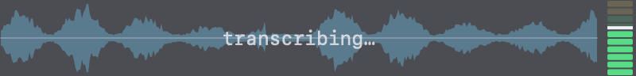

# Installing on macOS

The macOS half of the stack: hold **fn (Globe)**, speak, release, and whisper
`large-v3-turbo` transcribes on Metal, a local Qwen3-4B cleans the transcript,
and it is typed at the cursor. This doc covers `macos/install.sh`: what it
does, the three counterintuitive decisions upstream's own source forces on it,
and the manual steps only you can click.

Requires macOS 14.2+ on Apple Silicon (the meeting shim uses the 14.2
process-tap API), Xcode Command Line Tools (`xcode-select --install`) for the
two Swift sources, and Homebrew.

```sh
./install.sh                 # everything; --dry-run first is recommended
./install.sh --with-osd      # also build + install the macOS OSD renderer
./install.sh --with-meeting  # also build + install meeting mode (see below)
./install.sh --with-mlx      # also install the MLX benchmark server (8089)
./install.sh --uninstall
```

## What gets installed

| File | Installed to | Role |
|---|---|---|
| `voxtype` (upstream binary) | `~/.local/bin/` | the daemon; SHA256-verified from the upstream release |
| `voxtype-cleanup` | `~/.local/bin/` | post-processor: three structural guards, few-shot prompt, `local`/`claude`/`codex`/`openai`/`off` backends |
| `voxtype-notify` | `~/.local/bin/` | notification shim: terminal-notifier → osascript → silence |
| `llama-server-run` | `~/.local/bin/` | preflight (model present, Metal present) + exec for llama-server |
| `voxtype-meeting` | `~/.local/bin/` (`--with-meeting`) | meeting toggle wrapper + `export` + `summarize` (ordered backend chain, `codex,claude,local` by default; `local` only ever last) |
| `../vocabulary.conf` | `~/.config/voxtype/` | the shared dictation vocabulary, the single place a term is typed |
| `../voxtype-vocab` | `~/.local/bin/` | the vocabulary parser both consumers call |
| `osd/voxtype-osd-macos.swift` | compiled to `~/.local/bin/voxtype-osd-macos` | the whole macOS OSD renderer: frame reader, state watcher, NSPanel, drawing math ported from upstream's Rust OSD |
| `osd/com.tuantran.voxtype-osd.plist` | `~/Library/LaunchAgents/` | the OSD's own LaunchAgent (`--with-osd`) |
| `loopback/voxtype-loopback-macos.swift` | compiled to `~/.local/bin/voxtype-loopback-macos` + symlinks in `~/.local/libexec/voxtype-shims/{pactl,parec}` | the meeting-mode pactl/parec shim (a CoreAudio process tap) |
| `com.tuantran.llama-server.plist` | `~/Library/LaunchAgents/` | llama.cpp on Metal, port 8088 |
| `com.tuantran.mlx-server.plist` | `~/Library/LaunchAgents/` | optional mlx-lm benchmark server, port 8089 |
| `raycast/*.sh` | `~/raycast-scripts/` | Raycast script commands: meeting toggle + status row |

Everything shell-side runs under stock `/bin/bash` 3.2 (no Homebrew bash),
and the plists carry `__HOME__` placeholders the installer expands, so nothing
hard-codes a home directory. Two pieces are compiled at install time with
Command Line Tools' `swiftc` only (no Xcode project): the OSD (~2 s) and the
meeting shim (~4 s). Upstream ships neither as a macOS binary, so there is
nothing to download.

## Three counterintuitive decisions

**The daemon runs from Login Items, not a LaunchAgent.** `voxtype setup
launchd` is one command away and upstream's docs suggest it. It leaves a
daemon that never receives Microphone permission, because TCC attributes a
request to the *responsible process*, which for a launchd job is launchd, not
the app bundle. `voxtype setup app-bundle` builds `/Applications/Voxtype.app`,
registers it as a Login Item, and Login Items inherit the grants correctly.

**The app bundle is signed with a stable self-signed certificate, not ad-hoc.**
TCC validates against the code's designated requirement; an ad-hoc signature
has no stable one, so every voxtype upgrade rotates the cdhash and breaks all
the grants **while System Settings still shows them ticked**. The installer
creates a self-signed code-signing identity (`Voxtype Local Signing`, overridable
via `VOXTYPE_SIGNING_IDENTITY`) once, and re-signs the bundle with it after
every `voxtype setup app-bundle`, which itself always re-signs ad-hoc.

One one-time consequence, printed loudly when it applies: moving an ad-hoc
bundle onto the certificate changes the designated requirement, so grants made
against the old signature stop matching *while still looking ticked*. Re-tick
them once; after that the certificate carries them across upgrades.

**Four bytes of the daemon binary are rewritten, to keep it out of the Dock.**
A background dictation daemon should not hold a Dock tile, and upstream agrees:
the generated `Info.plist` sets `LSUIElement=true`. It does not take.
voxtype links `tao` (with `tray-icon`/`muda`, for the menu bar item), and tao
calls `-[NSApplication setActivationPolicy:]` itself at
`applicationDidFinishLaunching` with its builder default,
`ActivationPolicy::Regular`. A policy set from code beats `LSUIElement`, so
the tile returns on every launch. No config key controls it. The installer
rewrites the single instruction that supplies that argument:

```
ldrb w2, [x8, #0x28]   ->   mov w2, #1     # 1 = NSApplicationActivationPolicyAccessory
```

It is version-pinned and byte-checked: on any binary that does not match, the
patch is **skipped with a warning** rather than applied blind, and voxtype
keeps its Dock icon until `VOXTYPE_DOCK_VA` is re-derived. It costs nothing in
grants, since the designated requirement names the certificate leaf, not a
cdhash, and the re-sign happens immediately after. To confirm which way a
running daemon went:

```bash
lsappinfo list | grep -A4 '"Voxtype"'    # type="UIElement" patched, "Foreground" not
```

The real fix belongs upstream, and already exists there:
[peteonrails/voxtype#554](https://github.com/peteonrails/voxtype/pull/554) has
`src/menubar.rs` call `set_activation_policy(ActivationPolicy::Accessory)` on
the event loop before `run()`, which is the same instruction reached honestly.
It has sat in draft since 2026-08-03 over one red CI job, an unrelated clippy
`useless-format` in `src/tui/compositor_bindings.rs` that `dev` has since fixed
in `71db5a0`. The patch still applies cleanly to `dev`. When it lands, this
whole section should be deleted rather than re-pinned to a new address.

## The OSD

`--with-osd` compiles `voxtype-osd-macos` and installs it as its own
LaunchAgent. It attaches to `/tmp/voxtype/audio.sock`, which the daemon binds
whether or not `osd.enabled` is set, and draws the panel from the level frames
the daemon streams there at 100 Hz:


`osd.enabled` stays `false` on purpose. On macOS that key means "the daemon
must not spawn a frontend", and the daemon has no frontend to spawn: it looks
for a sibling of its own executable inside the sealed app bundle, or on a PATH
that excludes `~/.local/bin`. Running the renderer as a LaunchAgent instead of
as the daemon's child also means it needs no TCC grant of its own.

When you release the key the panel stays up and dims until the daemon writes
`idle` to `/tmp/voxtype/state`, so the silent cleanup gap is visible instead of
blank:



Both images are the renderer's own output rather than screenshots: run
`osd/render-docs-images.sh` to regenerate them from the current source.

## Meeting mode: the loopback shim

Upstream's meeting mode gets the remote side of a call by shelling out to
`pactl list short sources` and `parec --device <src> … --raw`, both
PATH-resolved, with nothing else platform-specific. `--with-meeting` exploits
that: one Swift binary (`voxtype-loopback-macos`) impersonates both behind
symlinks in a
**private** shim directory (`~/.local/libexec/voxtype-shims`) that only the
daemon's PATH can see, so a real PulseAudio install is never shadowed. The
capture itself is a CoreAudio process tap.

Two bundle patches make it work, applied between upstream's ad-hoc sign and
the re-sign:

- `LSEnvironment.PATH`. Login Items launch the daemon with launchd's minimal
  PATH, so `~/.local/bin` is invisible and `pactl`/`parec` would never
  resolve. The shim directory goes **first**, so it wins even when an
  inherited environment would have beaten LSEnvironment.
- `NSAudioCaptureUsageDescription`. tccd checks the *responsible app* for
  this key before allowing a process tap. Without it the refusal is silent:
  `noErr` everywhere, then all-zero or missing buffers. This is the single
  most common "the shim is broken" report, and it is a permissions key, not
  a bug. See [troubleshooting](troubleshooting.md).

Meeting mode adds one more TCC grant, System Audio Recording, which prompts
itself on the first meeting start (at `AudioDeviceStart`) rather than during
install.

## The manual steps (cannot be scripted)

1. Add the TCC grants. In System Settings → Privacy & Security, add Voxtype
   to:
   - **Microphone** (recording)
   - **Input Monitoring** (the fn/Globe push-to-talk hotkey)
   - **Accessibility** (typing the result at the cursor; it does not
     auto-prompt for a background process, so add it with the `+` button)
   - with `--with-meeting`: **System Audio Recording** (prompts itself on
     first meeting start)
2. Log out and back in once, so the Login Item starts the daemon the way it
   will every day. Running it from a terminal grants TCC to the *terminal*
   instead, which is the failure this whole setup avoids.
3. Fetch the models. The installer reports these and never downloads them
   (~multi-GB):

   ```sh
   # transcription: quantised large-v3-turbo (q5_0), the measured sweet spot
   curl -fL -o ~/.local/share/voxtype/models/ggml-large-v3-turbo-q5_0.bin \
     https://huggingface.co/ggerganov/whisper.cpp/resolve/main/ggml-large-v3-turbo-q5_0.bin
   voxtype config set whisper.model ~/.local/share/voxtype/models/ggml-large-v3-turbo-q5_0.bin

   # cleanup: Qwen3-4B Q4_K_M (Q8 if you have VRAM to spare)
   hf download unsloth/Qwen3-4B-Instruct-2507-GGUF Qwen3-4B-Instruct-2507-Q4_K_M.gguf \
      --local-dir ~/.local/share/models
   ```

## Verifying

```sh
codesign -d -r- /Applications/Voxtype.app   # must name the cert, not a bare cdhash
voxtype setup app-bundle --status
voxtype setup check                          # hotkey attached, VAD present
printf "um so can you check the uh tailscale status" | voxtype-cleanup
# expect: So can you check the Tailscale status?   (once llama-server is up)
grep -i hotkey ~/Library/Logs/voxtype/stdout.log | tail -5
```

With `--with-meeting`, test with a **real meeting while audio plays**, then
check the export has both a You and a Remote section:

```sh
voxtype-meeting start; sleep 5; voxtype-meeting stop
voxtype meeting export latest --speakers
```

Do not judge the shim by running `voxtype-loopback-macos --self-test` from a
terminal. A terminal is not an app declaring `NSAudioCaptureUsageDescription`,
so there the capture is refused silently and the self-test fails whatever the
daemon can do.

`bench-cleanup.sh` measures the cleanup backends head-to-head (latency
percentiles + prefix-cache behaviour) if you want numbers for your own
hardware.
